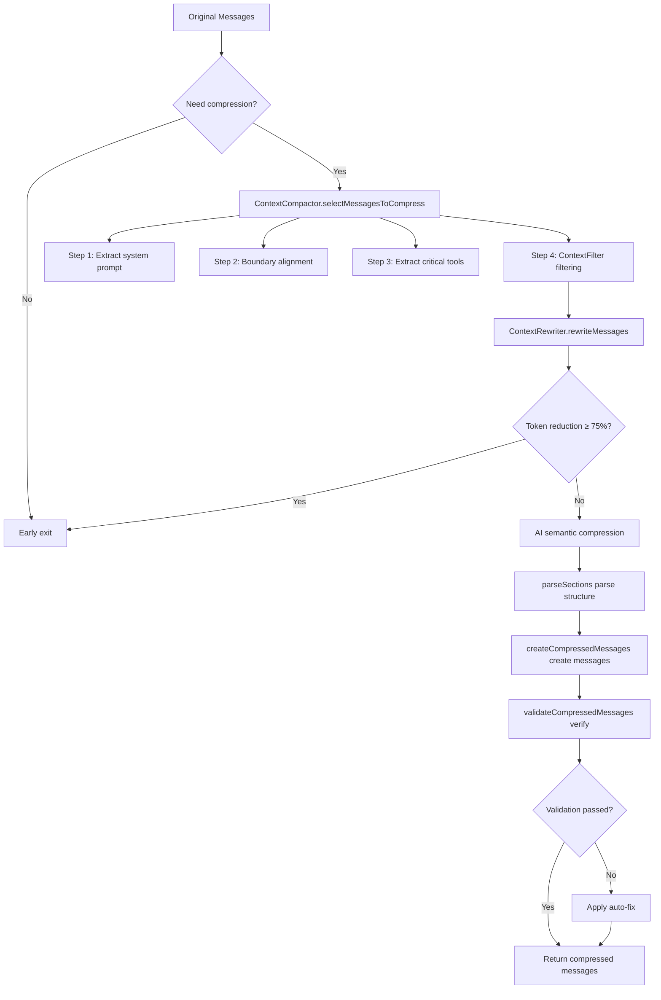

# Deep Dive into TalkCody's 3-Level Context Compaction Algorithm: Eliminating "Token Anxiety" from Long-Running Development Tasks

In the era of AI-assisted programming, Context is productivity. However, as conversations progress, the LLM's context window eventually faces challenges: skyrocketing Token costs, increased inference latency, and most importantly—large amounts of redundant information (such as repeated file reads, outdated search results) that interfere with the model's judgment.

TalkCody introduces an innovative **3-Level Compaction Algorithm**: **Prune + Rewrite + AI Compaction**. This algorithm is not just about saving Tokens, but about maintaining AI's "clarity" in long-running tasks (Long-run tasks).

---

## Context Compaction VS Database Optimizer

Database optimizers are also divided into 3 levels: Rule Based Optimizer, Cost Based Optimizer, and AI-driven adaptive optimizer. TalkCody's 3-Level Compaction Algorithm shares a similar design philosophy:

| Database Optimizer | TalkCody Context Compaction | Design Philosophy |
|-------------------|----------------------------|-------------------|
| **Rule Based Optimizer** executes query optimization based on predefined rules | **Prune** Rule-based physical filtering (deduplication, noise filtering) | Both use deterministic rules to quickly eliminate invalid data |
| **Cost Based Optimizer** selects optimal execution plans based on statistical information and cost models | **Rewrite** Structured code summarization based on Tree-sitter | Both perform intelligent compression through statistics (row count/Token count) and structural analysis |
| **AI-driven adaptive optimizer** uses machine learning to dynamically adjust execution plans | **AI Compaction** Uses LLM for semantic summarization and intelligent merging | Both utilize AI to understand high-level semantics of content |

This layered design reflects the philosophy of **progressive optimization**: first use low-cost rules to filter out large amounts of obviously invalid data, then use structured methods for compression, and finally call expensive AI capabilities only when necessary. This trade-off is equally effective in both database and AI fields.

## Key to Context Compaction

Ensure the ability to recover deleted information through the file system. Any information that can be retrieved later through file search can be safely removed.

This principle distinguishes Context Compaction from traditional text compression algorithms (such as gzip): traditional compression pursues lossless reconstruction, while Context Compaction pursues **semantic recoverability**. Specifically:

- **Recoverable information**: File content, code structure, error logs → can be re-acquired through tool calls, can be removed
- **Non-recoverable information**: User's original requirements, completed decisions, intermediate reasoning processes → must be retained

This design allows the Compaction algorithm to compress more aggressively while not affecting AI's judgment capability.

## System Architecture Overview

The 3-level compression algorithm works through the collaboration of three core modules:

```
Message Flow → ContextFilter → ContextRewriter → ContextCompactor → Compressed Messages
                (Level 1)        (Level 2)          (Level 3)
```

1. **ContextFilter**: Rule-based physical filtering to remove redundancy and noise
2. **ContextRewriter**: Tree-sitter-based structured code rewriting
3. **ContextCompactor**: AI-based semantic summarization and intelligent merging

---

## Level 1: Prune — The "Scalpel" for Removing Noise

The `ContextFilter` class is responsible for physical-level cleanup before conversation enters AI compression. It precisely identifies and removes redundant information through four major filtering rules.

### 1.1 Exploratory Tools Filtering

AI extensively uses tools like `glob`, `listFiles`, and `codeSearch` during early task exploration. These tools become noise once specific code is located.

**Core Mechanism**:
- **Protection Window**: Exploratory tools within the last 10 messages are retained
- **Smart Filtering**: All `glob`, `listFiles`, and `codeSearch` calls and their results outside the protection window are removed

### 1.2 Duplicate File Reads Deduplication

AI frequently reads the same file multiple times. `ContextFilter` identifies duplicates through precise file read keys:

**File Read Key Format**:
```
{file_path}:{start_line}:{line_count}
```

- `/src/app.ts:full:full` - Read entire file
- `/src/app.ts:100:50` - Read 50 lines starting from line 100

**Deduplication Strategy**:
- For the same file and line range, only keep the **latest read result**
- Reads with different line ranges are treated as independent operations and won't be deduplicated

### 1.3 Exact Duplicate Tool Call Detection

For any tool call, if its name and parameters are exactly the same, it's identified as a duplicate and only the latest is kept.

**Supported Exact Deduplication Scenarios**:
- `bash` calls with the same command
- `editFile` calls with the same parameters
- Any fully duplicate calls of any tool

### 1.4 Critical Tools Deduplication

For `todoWrite` and `exitPlanMode` critical tools, a different deduplication strategy is used:

- **Deduplicate by tool name**: Only keep the latest call for each tool, regardless of parameters
- **Independent management**: Deduplication for these tools is separated from other tools to ensure the latest task status and plan status

---

## Level 2: Rewrite — Tree-sitter-Based Structured Abstraction

The `ContextRewriter` class uses Tree-sitter syntax analysis to rewrite large files into skeleton code, significantly reducing Token usage.

### 2.1 Compression Threshold (Line Threshold)

Only code files exceeding **100 lines** will be rewritten:

### 2.2 Supported Programming Languages

Languages are automatically identified through file extensions, supporting mainstream programming languages:

| Extension | Language | Support Status |
|-----------|----------|----------------|
| `.ts` | TypeScript | ✅ |
| `.tsx` | TSX | ✅ |
| `.js` | JavaScript | ✅ |
| `.py` | Python | ✅ |
| `.rs` | Rust | ✅ |
| `.go` | Go | ✅ |
| `.java` | Java | ✅ |
| `.c` | C | ✅ |
| `.cpp` | C++ | ✅ |
| `.md`, `.json`, `.yaml`, `.txt` | Text files | ❌ |

**Unsupported Languages**: Markdown, JSON, YAML, HTML, CSS, etc., will not be rewritten and original content is preserved.

### 2.3 Code Summarization Mechanism

`ContextRewriter` handles two scenarios:

#### 2.3.1 readFile Result Summarization

When AI reads large files, `ContextRewriter` replaces the returned file content with a summary:

```typescript
// Original return
{
  "success": true,
  "file_path": "/src/app.ts",
  "content": "150 lines of full code...",
  "message": "Read /src/app.ts"
}

// After summarization
{
  "success": true,
  "file_path": "/src/app.ts",
  "content": "// Class: AppComponent\\n// Method: ngOnInit()\\n// Method: ngOnDestroy()\\n// ... (only signatures)",
  "message": "Read /src/app.ts [COMPRESSED: 150 lines → summarized]"
}
```

#### 2.3.2 writeFile Input Summarization

When AI prepares to write large files, `ContextRewriter` summarizes the input content:

```typescript
// Original input
{
  "file_path": "/src/app.ts",
  "content": "150 lines of code to write..."
}

// After summarization
{
  "file_path": "/src/app.ts",
  "content": "// Summarized: function signatures..."
}
```

### 2.4 Compression Markers

All summarized content is tagged with `[COMPRESSED: {original_lines} lines → summarized]`, making it clear to both users and AI that this is a summary, not original code.

---

## Level 3: AI Compaction — High-Dimensional Information Concentration

The `ContextCompactor` class is responsible for converting filtered and rewritten messages into structured semantic summaries.

### 3.1 Smart Message Selection (selectMessagesToCompress)

`ContextCompactor` uses a four-step process to select messages to compress and retain:

#### Step 1: Extract System Prompt

The first message is typically the system prompt and should never be compressed.

#### Step 2: Boundary Alignment (adjustPreserveBoundary)

To prevent breaking `tool-call` and `tool-result` pairs (which would cause errors in models like Anthropic), the algorithm intelligently adjusts the retention boundary:

**How it works**:
1. Scan all `tool-result`s in the retention area and collect their `toolCallId`s
2. Scan backwards to find the `tool-call`s corresponding to these `toolCallId`s
3. Extend the retention boundary to include these `tool-call`s

#### Step 3: Extract Critical Tool Calls (extractLastToolCalls)

Certain critical tool calls must be extracted from the compression area and retained in the retention area:

**Critical Tool List**:
- `exitPlanMode`: Plan status
- `todoWrite`: Task list

The latest calls to these tools and their results are fully retained, even if they're outside the protection window.

#### Step 4: Apply Message Filtering

Finally, apply all filtering rules from `ContextFilter` to the remaining messages.

### 3.2 Early Exit Optimization

Before calling expensive AI compression, `ContextCompactor` checks if Tree-sitter rewriting is already sufficiently effective:

**Judgment Criteria**:
- If Token reduction ratio ≥ 75%, skip AI compression
- Directly use rewritten messages

This dramatically reduces the frequency of calling expensive long-context models, decreasing cost and latency.

### 3.3 Structured Summary Parsing (parseSections)

The summary returned by AI is organized in a specific structure, and `ContextCompactor` uses multi-mode regex to extract it:

**Standard 8 Sections**:
1. Primary Request and Intent
2. Key Technical Concepts
3. Files and Code Sections
4. Errors and fixes
5. Problem Solving
6. All user messages
7. Pending Tasks
8. Current Work

### 3.4 Old Summary Compression (condensePreviousSummary)

To prevent the summary itself from growing infinitely, the algorithm recursively compresses old summaries:

**Compression Strategy**:
1. Limit maximum length to **8000 characters** (`MAX_SUMMARY_LENGTH`)
2. Prioritize retaining key sections: `Pending Tasks`, `Current Work`, `Errors and fixes`
3. Each key section retains at most 500 characters
4. If no structured sections are found, use truncation with ellipsis

### 3.5 Message Creation Flow (createCompressedMessages)

Compressed messages are created in a strict three-step process:

#### Step 1: Retain Original System Prompt

#### Step 2: Add Compressed Summary as User Message

**Key Design**: Summary is inserted as `user` role, with an `assistant` confirmation action attached.

**Why design it this way?**
- LLM API strictly requires alternating messages (user/assistant/user/assistant...)
- Inserting summary as `user` role ensures stability of subsequent conversations
- Assistant confirmation action maintains the "turn-taking" conversation protocol

#### Step 3: Add Remaining Retained Messages

Skip old summary messages (already compressed in step 2) and add other retained messages.

### 3.6 Message Validation and Auto-Fix (validateCompressedMessages)

To ensure compressed messages meet LLM API requirements, `ContextCompactor` provides comprehensive validation and auto-fix:

#### Detected Issues:

1. **Orphan Tool Messages**:
   - Orphan `tool-call`: Has call but no result
   - Orphan `tool-result`: Has result but no call

2. **Consecutive Assistant Messages**: Multiple consecutive `assistant` messages

#### Auto-Fix Strategies:

1. **Remove orphan tool calls**
2. **Remove orphan tool results**
3. **Merge consecutive assistant messages**


---

## Complete Workflow of the 3-Level Compression Algorithm



---

## Value of the 3-Level Compression Algorithm: Why Is It Universally Applicable?

### 1. Handling Long-Running Tasks

In complex refactoring or new feature development, conversations may last hundreds of turns. Traditional "simple truncation" causes AI to forget initial requirements or completed steps. TalkCody's 3-level compression ensures:

- ✅ **Critical state (TODO/Plan) never lost**: Extract critical tool calls through `extractLastToolCalls`
- ✅ **High-frequency noise (searches/duplicate reads) instantly cleaned**: Through `ContextFilter`'s protection window and precise deduplication
- ✅ **Core logic (code skeleton) semantically resident**: Through `ContextRewriter`'s Tree-sitter summarization
- ✅ **Message alternation and integrity**: Ensure LLM API compatibility through boundary alignment and validation

### 2. Extreme Cost-Performance and Performance Balance

**Cost Optimization**:
- Level 1 (Prune): Zero cost, pure rule-based filtering
- Level 2 (Rewrite): Low cost, Tree-sitter local processing
- Level 3 (AI): Called only when necessary, early exit optimization reduces AI calls by over 75%

**Performance Optimization**:
- Parallel filtering rules, complete all filtering in a single pass
- Incremental message processing, avoiding full reconstruction
- Smart caching and state tracking

### 3. Algorithm Universality

**Language Agnostic**:
- Tree-sitter-based `ContextRewriter` supports almost all mainstream programming languages
- Easily extend support by adding new language mappings

**Model Agnostic**:
- Semantic summarization layer adapts to various LLM providers (OpenAI, Anthropic, Gemini, etc.)
- Doesn't depend on specific API format, only requires text summary return

**Scenario Agnostic**:
- Not only applicable to code development, but also to long-running tasks like document writing and data analysis
- Filtering rules are configurable to adapt to different domains

---

## Specialized Small Models for Compaction: The Next Frontier

### Why Specialized Small Models Are Suitable for Context Compaction?

In fact, context compaction is particularly suitable for implementation by specialized small models—faster speed, lower cost.

#### Technical Advantages

1. **Clear Task Boundaries**: Compaction's input/output format is very clear (message list → compressed summary), making it easy to train
2. **Quantifiable Evaluation Metrics**: Token reduction rate, information retention rate, inference latency, etc., can all be precisely measured
3. **Cost-Sensitive Scenarios**: In long-running tasks, Compaction is called frequently, and single savings are magnified
4. **High Speed Requirements**: Compaction shouldn't become the main bottleneck of user wait time

#### Domain-Specific Models vs General Models

| Metric | General LLM (e.g., GPT-4) | Specialized Compaction Model |
|--------|-------------------------|---------------------------|
| Training Data | General domain text | Programming conversations, code context |
| Inference Speed | ~30-100 tokens/s | ~1000+ tokens/s (expected) |
| Cost | $0.01-0.03/1K tokens | $0.001-0.005/1K tokens (expected) |
| Understanding Ability | Broad but shallow | Specialized but deep |

This trend of **Model Specialization** is emerging in the AI field: by training small models on specific tasks, you can significantly improve efficiency and reduce costs while maintaining quality.

### Current Practice: MorphLLM's Exploration

[morphllm](https://www.morphllm.com/) currently implements two specialized small models, providing valuable reference for us:

#### Fast Apply Model
- **Function**: Quickly implement diff merge for files
- **Performance**: Speed up to 10,500 tokens/s, accuracy 98%
- **Scenario**: Applying AI-generated code changes to files

#### Warp Grep Model
- **Function**: Search codebase through inference from multiple grep, read, list_dir tool calls
- **Scenario**: Code exploration and localization

### Critical Analysis of MorphLLM

While MorphLLM's attempts are commendable, I believe both directions have limitations:

#### Limitations of Fast Apply Model

The pain point this model addresses has relatively low weight in AI coding:

1. **Time Allocation Mismatch**: According to actual data statistics, AI coding time is mainly spent on:
   - **Explore**: Understanding codebase structure, accounting for 40-50%
   - **Plan**: Designing solutions, accounting for 30-40%
   - **Edit**: Actually writing code, only accounting for 10-20%

2. **Diminishing Marginal Returns**: Even if the Edit phase speed is improved 10x, overall task time can only be reduced by 2-4%

3. **Existing Optimization Space**: Modern LLMs already have strong code generation capabilities; the bottleneck is not generation speed but understanding depth

#### Limitations of Warp Grep Model

This model's direction is contrary to current technological trends:

1. **Popularity of Parallel Tool Calls**:
   - The latest Coding models already support parallel tool call
   - A single request can simultaneously initiate 10+ search operations

2. **Ai Coding Agent Framework Optimization**:
   - TalkCody already has built-in intelligent parallel scheduling
   - No need to decide tool call order through model inference

I believe **specialized small models focused on context compaction** will definitely emerge in the future.

## Conclusion

TalkCody's 3-level compression algorithm demonstrates that: **Efficient AI development depends not just on how strong the model is, but on how you manage the information fed to the model.**

Through this algorithm, TalkCody is able to:
- 🚀 **Support ultra-long conversations**: Hundreds of turns while maintaining context coherence
- 💰 **Reduce costs**: Reduce Token usage by over 75% through early exit and smart filtering
- ⚡ **Improve response speed**: Reduce input Token count, lower inference latency
- 🎯 **Maintain accuracy**: Ensure AI doesn't lose important information through critical state protection and smart summarization
