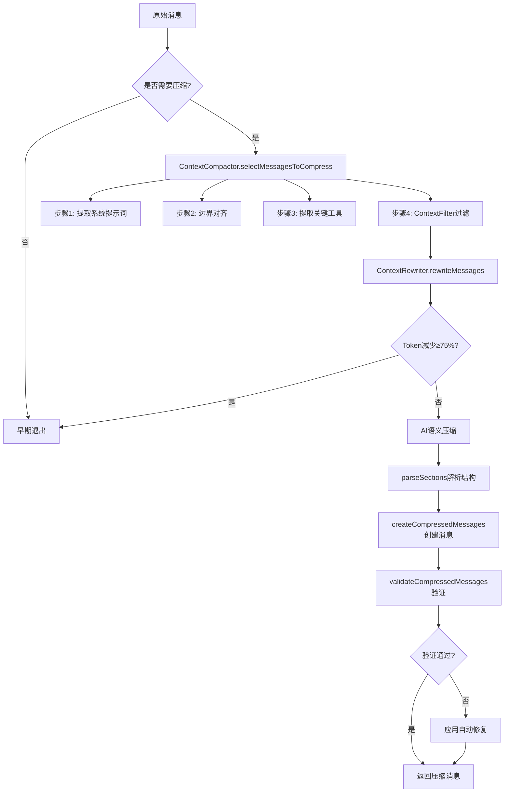

# 深度解析 TalkCody 的 3 级上下文压缩算法：让长程开发任务告别"Token 焦虑"

在 AI 辅助编程的时代，Context（上下文）就是生产力。然而，随着对话的深入，LLM 的上下文窗口终会面临挑战：Token 成本激增、推理延迟加大、以及最重要的——大量冗余信息（如重复的文件读取、过时的搜索结果）会干扰模型的判断力。

TalkCody 引入了一套创新的 **3 级 Compaction（压缩）算法**：**Prune（精简） + Rewrite（重写） + AI Compaction（语义压缩）**。这套算法不仅是为了节省 Token，更是为了在长程任务（Long-run tasks）中保持 AI 的"清醒度"。

---

## Context Compaction VS 数据库优化器

数据库的优化器也分为3级：Rule Based Optimizer（基于规则的优化器）、Cost Based Optimizer（基于成本的优化器）和AI驱动的自适应优化器。TalkCody 的 3 级 Compaction 算法在设计理念上有异曲同工之妙：

| 数据库优化器 | TalkCody Context Compaction | 设计理念 |
|-------------|---------------------------|---------|
| **Rule Based Optimizer** 基于预定义规则执行查询优化 | **Prune** 基于规则的物理过滤（去重、噪音过滤） | 都使用确定性规则快速剔除无效数据 |
| **Cost Based Optimizer** 基于统计信息和成本模型选择最优执行计划 | **Rewrite** 基于 Tree-sitter 的结构化代码摘要 | 都通过统计（行数/Token数）和结构分析进行智能压缩 |
| **AI驱动自适应优化器** 利用机器学习动态调整执行计划 | **AI Compaction** 利用 LLM 进行语义总结和智能合并 | 都利用 AI 理解内容的高级语义 |

这种分层设计体现了**渐进式优化**的哲学：先用低成本的规则过滤大量明显无效的数据，再用结构化方法压缩，最后仅在必要时调用昂贵的 AI 能力。这种权衡在数据库和 AI 领域都同样有效。

## Context Compaction 的关键

确保删减的信息最终可以通过文件系统恢复的能力。只要之后可以通过文件搜索获取的信息，就可以安全地删减。

这一原则将 Context Compaction 与传统文本压缩算法（如 gzip）区分开来：传统压缩追求无损重建，而 Context Compaction 追求**语义可恢复性**。具体来说：

- **可恢复信息**：文件内容、代码结构、错误日志 → 可通过工具调用重新获取，可以删减
- **不可恢复信息**：用户的原始需求、已完成的决策、中间推理过程 → 必须保留

这种设计使得 Compaction 算法可以更激进地压缩，同时不影响 AI 的判断能力。

## 系统架构概览

3 级压缩算法由三个核心模块协同工作：

```
消息流 → ContextFilter → ContextRewriter → ContextCompactor → 压缩后的消息
         (第一级)        (第二级)          (第三级)
```

1. **ContextFilter**：基于规则的物理过滤，去除冗余和噪音
2. **ContextRewriter**：基于 Tree-sitter 的结构化代码重写
3. **ContextCompactor**：基于 AI 的语义总结和智能合并

---

## 第一级：Prune（精简）—— 去除噪音的"手术刀"

`ContextFilter` 类负责在对话进入 AI 压缩之前进行物理层面的清理。它通过四大过滤规则，精准地识别并移除冗余信息。

### 1.1 探索性工具过滤（Exploratory Tools Filtering）

AI 在任务初期会大量使用 `glob`、`listFiles`、`codeSearch` 等工具来探索代码库。这些工具在定位到具体代码后就成了噪音。

**核心机制**：
- **保护窗口**：最近 10 条消息内的探索性工具被保留
- **智能过滤**：保护窗口之外的所有 `glob`、`listFiles`、`codeSearch` 调用及其结果被移除

### 1.2 重复文件读取去重（Duplicate File Reads）

AI 经常会多次读取同一个文件。`ContextFilter` 通过精确的文件读取键识别重复：

**文件读取键格式**：
```
{file_path}:{start_line}:{line_count}
```

- `/src/app.ts:full:full` - 读取整个文件
- `/src/app.ts:100:50` - 从第 100 行开始读取 50 行

**去重策略**：
- 对于同一个文件和相同的行范围，只保留**最新的读取结果**
- 不同行范围的读取被视为独立操作，不会去重

### 1.3 精确重复工具调用检测（Exact Duplicate Tool Calls）

对于任何工具调用，如果其名称和参数完全相同，就会被识别为重复并只保留最新的。

**支持的精确去重场景**：
- 相同命令的 `bash` 调用
- 相同参数的 `editFile` 调用
- 任何工具的完全重复调用

### 1.4 关键工具去重（Deduplicate Critical Tools）

对于 `todoWrite` 和 `exitPlanMode` 这两个关键工具，采用不同的去重策略：

- **按工具名称去重**：不考虑参数，只保留每个工具的最新一次调用
- **独立管理**：这两个工具的去重与其他工具分离，确保任务状态和计划状态的最新性

---

## 第二级：Rewrite（重写）—— 基于 Tree-sitter 的结构化抽象

`ContextRewriter` 类通过 Tree-sitter 语法分析，将大文件重写为骨架代码，大幅减少 Token 使用。

### 2.1 压缩阈值（Line Threshold）

只有超过 **100 行**的代码文件才会被重写：

### 2.2 支持的编程语言

通过文件扩展名自动识别语言，支持主流编程语言：

| 扩展名 | 语言 | 支持状态 |
|--------|------|----------|
| `.ts` | TypeScript | ✅ |
| `.tsx` | TSX | ✅ |
| `.js` | JavaScript | ✅ |
| `.py` | Python | ✅ |
| `.rs` | Rust | ✅ |
| `.go` | Go | ✅ |
| `.java` | Java | ✅ |
| `.c` | C | ✅ |
| `.cpp` | C++ | ✅ |
| `.md`, `.json`, `.yaml`, `.txt` | 文本文件 | ❌ |

**不支持的语言**：Markdown、JSON、YAML、HTML、CSS 等不会被重写，保留原始内容。

### 2.3 代码摘要化机制

`ContextRewriter` 处理两种场景：

#### 2.3.1 readFile 结果摘要化

当 AI 读取大文件时，`ContextRewriter` 将返回的文件内容替换为摘要：

```typescript
// 原始返回
{
  "success": true,
  "file_path": "/src/app.ts",
  "content": "150 lines of full code...",
  "message": "Read /src/app.ts"
}

// 摘要化后
{
  "success": true,
  "file_path": "/src/app.ts",
  "content": "// Class: AppComponent\n// Method: ngOnInit()\n// Method: ngOnDestroy()\n// ... (only signatures)",
  "message": "Read /src/app.ts [COMPRESSED: 150 lines → summarized]"
}
```

#### 2.3.2 writeFile 输入摘要化

当 AI 准备写入大文件时，`ContextRewriter` 将输入内容摘要化：

```typescript
// 原始输入
{
  "file_path": "/src/app.ts",
  "content": "150 lines of code to write..."
}

// 摘要化后
{
  "file_path": "/src/app.ts",
  "content": "// Summarized: function signatures..."
}
```

### 2.4 压缩标记

所有被摘要化的内容都会添加 `[COMPRESSED: {original_lines} lines → summarized]` 标记，让用户和 AI 明知这是摘要而非原始代码。

---

## 第三级：AI Compaction（语义压缩）—— 高维度的信息浓缩

`ContextCompactor` 类负责将过滤和重写后的消息转换为结构化的语义总结。

### 3.1 智能消息选择（selectMessagesToCompress）

`ContextCompactor` 采用四步流程选择要压缩和保留的消息：

#### 步骤 1：提取系统提示词

第一条消息通常是系统提示词，永远不应被压缩。

#### 步骤 2：边界对齐（adjustPreserveBoundary）

为了防止切断 `tool-call` 和 `tool-result` 的配对（这会导致 Anthropic 等模型报错），算法会智能调整保留边界：

**工作原理**：
1. 扫描保留区域的所有 `tool-result`，收集其 `toolCallId`
2. 向后扫描，找到这些 `toolCallId` 对应的 `tool-call`
3. 将保留边界扩展到包含这些 `tool-call`

#### 步骤 3：提取关键工具调用（extractLastToolCalls）

某些关键工具调用必须从压缩区域提取并保留到保留区域：

**关键工具列表**：
- `exitPlanMode`：计划状态
- `todoWrite`：任务列表

这些工具的最新调用及其结果会被完整保留，即使它们在保护窗口之外。

#### 步骤 4：应用消息过滤

最后，对剩余的消息应用 `ContextFilter` 的所有过滤规则。

### 3.2 早期退出优化（Early Exit Optimization）

在调用昂贵的 AI 压缩之前，`ContextCompactor` 会检查 Tree-sitter 重写是否已经足够有效：

**判断标准**：
- 如果 Token 减少比例 ≥ 75%，跳过 AI 压缩
- 直接使用重写后的消息

这极大地降低了调用昂贵长上下文模型的频率，减少了成本和延迟。

### 3.3 结构化总结解析（parseSections）

AI 返回的总结按照特定结构组织，`ContextCompactor` 使用多模式正则表达式提取：

**标准 8 个部分**：
1. Primary Request and Intent（主要请求和意图）
2. Key Technical Concepts（关键技术概念）
3. Files and Code Sections（文件和代码段）
4. Errors and fixes（错误和修复）
5. Problem Solving（问题解决）
6. All user messages（所有用户消息）
7. Pending Tasks（待办任务）
8. Current Work（当前工作）

### 3.4 旧总结压缩（condensePreviousSummary）

为了防止总结本身无限增长，算法会递归地压缩旧总结：

**压缩策略**：
1. 限制最大长度为 **8000 字符**（`MAX_SUMMARY_LENGTH`）
2. 优先保留关键部分：`Pending Tasks`、`Current Work`、`Errors and fixes`
3. 每个关键部分最多保留 500 字符
4. 如果没有找到结构化部分，使用截断和省略号

### 3.5 消息创建流程（createCompressedMessages）

压缩后的消息按照严格的三步流程创建：

#### 步骤 1：保留原始系统提示词

#### 步骤 2：添加压缩总结为用户消息

**关键设计**：总结以 `user` 角色插入，并附加 `assistant` 确认动作

**为什么这样设计？**
- LLM API 严格要求消息交替（user/assistant/user/assistant...）
- 以 `user` 角色插入总结确保后续对话的稳定性
- 助手确认动作维持了"轮流对话"协议

#### 步骤 3：添加剩余保留消息

跳过旧总结消息（已在步骤 2 中压缩），添加其他保留消息。

### 3.6 消息验证和自动修复（validateCompressedMessages）

为了确保压缩后的消息符合 LLM API 要求，`ContextCompactor` 提供全面的验证和自动修复：

#### 检测的问题：

1. **孤儿工具消息**：
   - 孤儿 `tool-call`：有调用但无结果
   - 孤儿 `tool-result`：有结果但无调用

2. **连续助手消息**：多个连续的 `assistant` 消息

#### 自动修复策略：

1. **移除孤儿工具调用**
2. **移除孤儿工具结果**
3. **合并连续助手消息**


---

## 3 级压缩算法的完整工作流程



---

## 3 级压缩算法的价值：为什么它具有普适性？

### 1. 应对长程任务（Long-run tasks）

在复杂的重构或新功能开发中，对话可能持续数百轮。传统的"简单截断"会导致 AI 忘记最初的需求或已经完成的步骤。TalkCody 的 3 级压缩确保了：

- ✅ **关键状态（TODO/Plan）永不丢失**：通过 `extractLastToolCalls` 提取关键工具调用
- ✅ **高频噪音（搜索/重复读）即时清理**：通过 `ContextFilter` 的保护窗口和精确去重
- ✅ **核心逻辑（代码骨架）语义常驻**：通过 `ContextRewriter` 的 Tree-sitter 摘要化
- ✅ **消息交替和完整性**：通过边界对齐和验证确保 LLM API 兼容性

### 2. 极致的性价比与性能平衡

**成本优化**：
- 第一级（Prune）：零成本，纯规则过滤
- 第二级（Rewrite）：低成本，Tree-sitter 本地处理
- 第三级（AI）：仅在必要时调用，早期退出优化减少 75% 以上的 AI 调用

**性能优化**：
- 并行过滤规则，单次遍历完成所有过滤
- 增量式消息处理，避免全量重构
- 智能缓存和状态跟踪

### 3. 算法的普适性

**语言无关**：
- 基于 Tree-sitter 的 `ContextRewriter` 支持几乎所有主流编程语言
- 可通过添加新的语言映射轻松扩展支持

**模型无关**：
- 语义总结层适配各种 LLM 供应商（OpenAI, Anthropic, Gemini 等）
- 不依赖特定 API 格式，只要求返回文本总结

**场景无关**：
- 不仅适用于代码开发，也适用于文档编写、数据分析等长程任务
- 过滤规则可配置，适应不同领域

---

## 专注 Compaction 的小模型：下一个前沿

### 为什么专门的小模型适合 Context Compaction？

其实 context compaction 这个工作特别适合专门的小模型来实现，速度更快，成本更低。

#### 技术优势

1. **任务边界清晰**：Compaction 的输入输出格式非常明确（消息列表 → 压缩摘要），易于训练
2. **评估指标可量化**：Token 减少率、信息保留率、推理延迟等都可以精确测量
3. **成本敏感场景**：在长程任务中，Compaction 会被频繁调用，单次节省的成本会被放大
4. **速度要求高**：Compaction 不应该成为用户等待时间的主要瓶颈

#### 领域专用模型 vs 通用模型

| 指标 | 通用 LLM（如 GPT-4） | 专用 Compaction 模型 |
|------|-------------------|-------------------|
| 训练数据 | 通用领域文本 | 编程对话、代码上下文 |
| 推理速度 | ~30-100 tokens/s | ~1000+ tokens/s（预期） |
| 成本 | $0.01-0.03/1K tokens | $0.001-0.005/1K tokens（预期） |
| 理解能力 | 广泛但浅层 | 专精但深刻 |

这种**模型专业化**（Model Specialization）的趋势正在 AI 领域兴起：通过在特定任务上训练小模型，可以在保持质量的同时大幅提升效率和降低成本。

### 当前实践：MorphLLM 的探索

[morphllm](https://www.morphllm.com/) 目前实现了两个专门的小模型，为我们提供了有价值的参考：

#### Fast Apply 模型
- **功能**：快速实现文件的 diff merge
- **性能**：速度可达 10,500 tokens/s，准确率 98%
- **场景**：将 AI 生成的代码变更应用到文件

#### Warp Grep 模型
- **功能**：通过多次 grep、read、list_dir 工具调用的推理来搜索代码库
- **场景**：代码探索和定位

### 对 MorphLLM 的批判性分析

虽然 MorphLLM 的尝试值得肯定，但我认为这两个方向都存在局限性：

#### Fast Apply 模型的局限性

这个模型解决的痛点在 AI coding 中的权重相对较低：

1. **时间分配不匹配**：根据实际数据统计，AI coding 的时间主要消耗在：
   - **Explore（探索）**：理解代码库结构，占 40-50%
   - **Plan（规划）**：设计解决方案，占 30-40%
   - **Edit（编辑）**：实际编写代码，仅占 10-20%

2. **边际收益递减**：即使将 Edit 阶段的速度提升 10 倍，整体任务耗时也只能减少 2-4%

3. **已有优化空间**：现代 LLM 的代码生成能力已经很强，瓶颈不在生成速度而在理解深度

#### Warp Grep 模型的局限性

这个模型的方向与当前技术趋势相悖：

1. **并行 Tool Call 的普及**：
   - 最新的 Coding 模型已经支持并行 tool call
   - 一次请求可以同时发起 10+ 个搜索操作

2. **Ai Coding Agent 框架优化**：
   - TalkCody 已经内置了智能的并行调度
   - 不需要通过模型推理来决定工具调用顺序


我认为**专注于 context compaction 的小模型** 之后一定会出现。

## 结语

TalkCody 的 3 级压缩算法证明了：**高效的 AI 开发不仅仅取决于模型有多强，更取决于你如何管理喂给模型的信息。**

通过这套算法，TalkCody 能够：
- 🚀 **支持超长对话**：数百轮对话仍保持上下文连贯性
- 💰 **降低成本**：通过早期退出和智能过滤减少 75% 以上的 Token 使用
- ⚡ **提升响应速度**：减少输入 Token 数量，降低推理延迟
- 🎯 **保持准确性**：通过关键状态保护和智能摘要，确保 AI 不丢失重要信息
